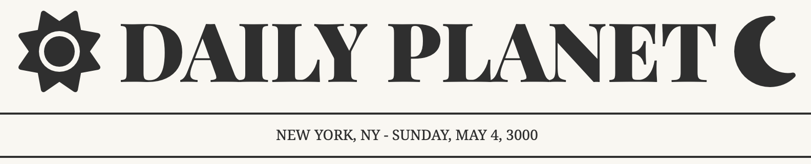

# DOM Intro Exercise: Daily Planet Date

You work for the Daily Planet, an astrology site that recently gained popularity after being featured in a TikTok influencer's morning routine. This influx of traffic has inspired your team to expedite some UX updates that have been sitting on the kanban board for awhile.

Currently, the subheading of the site displays the company's location.

You've been tasked with the job of updating the codebase so the current date automatically displays on page load in the subheading.

## Deliverable: Today's Date

[Lesson Notes](https://git.generalassemb.ly/SEI-Standard-Curriculum/SEIR-Course-Materials/blob/main/Unit_1/04-dom/4.1-dom-intro.md) | [Starter Code Live]( https://pages.git.generalassemb.ly/taylor-darneille/dom-intro-exercise/) | [Solution Code Demo](https://pages.git.generalassemb.ly/taylor-darneille/dom-intro-solution/)

(This repo holds the starter code.)

## Requirements
_Use Javascript to add a hyphen and today's date to the subheading (in all caps)._

_**Do not hardcode the date!** Instead, use the [javascript Date object and it's methods](https://www.w3schools.com/jsref/jsref_obj_date.asp) to render the current date. This way it updates automatically on page load. (Otherwise you'd have to manually update it each day.)_

## Steps

    
Step 0

    If you haven't noticed yet - the javascript isn't linked to the html yet! Throw a <code>script</code> tag at the bottom of the body or use the <code>defer</code> attribute and put it in the <code>head</code>. Make sure it goes below the font awesome <code>script</code> tag that is already present in the <code>head</code>.

    
Code

    <code>    
        
    </code>

Step 1

    Get today's date and store it in a variable

Code

    <code>const d = new Date()</code>

Step 2

    Use the [getMonth()](https://www.w3schools.com/jsref/jsref_getmonth.asp) method on the date to get a number for the month.

Code

    <code>const monthIndex = d.getMonth()</code>

Step 3

    Create an array of all 12 months in order, starting with January. Use the <code>monthIndex</code> to pull the name of the current month from this array and store it in a variable.

Code

    <code>
        const months = ["January","February","March","April","May","June","July","August","September","October","November","December"]
        const month = months[monthIndex]
    </code>

Step 4

    Repeat steps 2 & 3 using <code>getDay()</code> to acquire the day of the week.

Code

    <code>
        const days = ["Sunday","Monday","Tuesday","Wednesday","Thursday","Friday","Saturday"]
        const day = days[d.getDay()]
    </code>

Step 5

    Use<code>getDate()</code> to acquire the date number.

Code

    <code>const date = d.getDate()</code>

Step 6

    Use<code>getFullYear()</code> to acquire the year number.

Code

    <code>const year = d.getFullYear()</code>

Step 7

    Use string interpolation or concatenation to build the string you want to add to the subheading. Don't forget the hyphen, spaces, and commas!

Code

    <code>
        const dString = ` - ${day}, ${month} ${date}, ${year}`
    </code>

Step 8

    Select the DOM element that holds the subheading and store it in a variable.

Code

    <code>
        const section = document.querySelector(".subhead")
    </code>

Step 9

    Use string concatenation to add your date string to the current <code>innerText</code> of the subheading. Make it uppercase!

Code

    <code>
        section.innerText = section.innerText+dString.toUpperCase()
    </code>

---
#### Inspiration
* [Drops of Jupiter](https://youtu.be/7Xf-Lesrkuc)
* [forecmipsum](https://forcemipsum.com/)
* [Astrology Ipsum](https://iyanna-buffaloe.github.io/astrology-ipsum/)
* [Newspaper Style Design](https://codepen.io/silkine/pen/QWBxVX)
