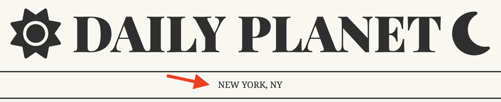
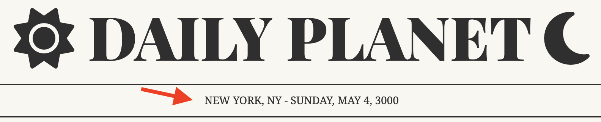
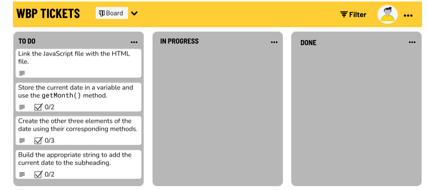

# DOM Intro Exercise: Daily Planet Date

You work for the Daily Planet, an astrology site that recently gained popularity after being featured in a TikTok influencer's morning routine. This influx of traffic has inspired your team to expedite some UX updates that have been sitting on the kanban board for awhile.

Currently, the subheading of the site displays the company's location.

You've been tasked with the job of updating the codebase so the current date automatically displays on page load in the subheading.

---

## Deliverable: Today's Date

[Starter Code Repo](https://git.generalassemb.ly/SEI-Standard-Curriculum/M1L8-dom-intro-wbp)

1. Connect the JavaScript file to the HTML file.

1. Use the [javascript Date object and it's methods](https://developer.mozilla.org/en-US/docs/Web/JavaScript/Reference/Global_Objects/Date/getDay) to render the current date.

    _**Do not hardcode the date!** This way it updates automatically on page load. (Otherwise you'd have to manually update it each day.)_

1. Use string interpolation or concatenation to build the string you want to add to the subheading.

---

---

### Preparation Steps

### Step 1

 If you haven't noticed already - the javascript isn't linked to the html yet! Add a `script` tag to the head of your HTML (don't forget to use the `defer` attribute) that links to your `script.js` file. Make sure it goes below the font awesome `script` tag that is already present in the `head`.

### Step 2

Get today's date and store it in a variable. Then:
- Use the [`getMonth()`](https://developer.mozilla.org/en-US/docs/Web/JavaScript/Reference/Global_Objects/Date/getMonth) method on the date to determine the current month. Store it's return value in a variable named `monthIndex`.
    - Note: Why are we calling this variable `monthIndex` ? Check the expected output of `getMonth()` if this is confusing.
- Create an array of all 12 months in order, starting with January. Use the `monthIndex` to pull the name of the current month from this array and store it in a variable.

### Step 3

Using the same process you did with the `getMonth()` method, use the following methods to dynamically retrieve the day:
- Use [`getDay()`](https://developer.mozilla.org/en-US/docs/Web/JavaScript/Reference/Global_Objects/Date/getDay) to acquire the day of the week.
    - Note: Not getting the correct date? Check the documentation on the return value a bit closer. 

Next, use the follow methods to retrieve the date and year:
- Use [`getDate()`](https://developer.mozilla.org/en-US/docs/Web/JavaScript/Reference/Global_Objects/Date/getDate) to acquire the date number.
- Use [`getFullYear()`](https://developer.mozilla.org/en-US/docs/Web/JavaScript/Reference/Global_Objects/Date/getFullYear) to acquire the year number.

### Step 4

Use string interpolation or concatenation to build the string you want to add to the subheading. Don't forget the hyphen, spaces, and commas!
- Select the DOM element that holds the subheading and store it in a variable.
- Use string concatenation to add your date string to the current `innerText` of the subheading. Make it uppercase!

