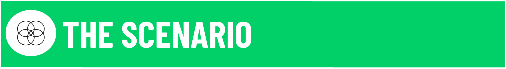
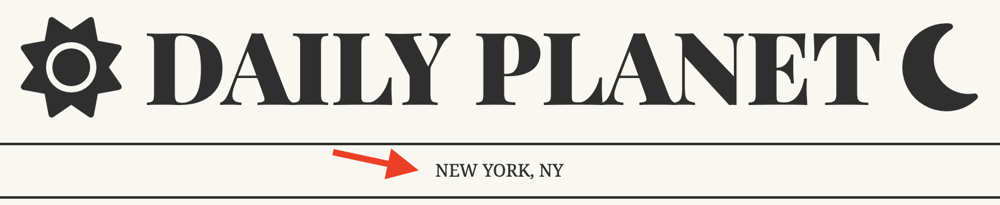
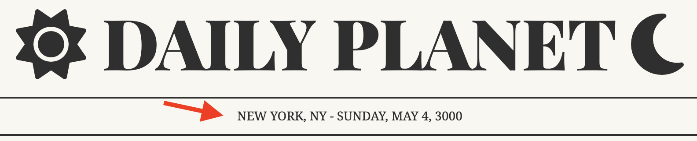
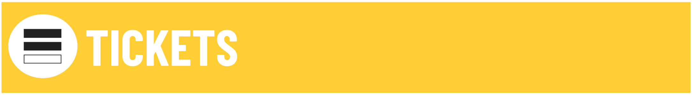
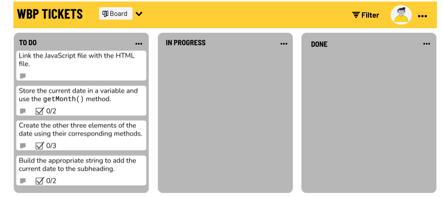

# DOM Intro Exercise: Daily Planet Date

You work for the Daily Planet, an astrology site that recently gained popularity after being featured in a TikTok influencer's morning routine. This influx of traffic has inspired your team to expedite some UX updates that have been sitting on the kanban board for awhile.

Currently, the subheading of the site displays the company's location.

You've been tasked with the job of updating the codebase so the current date automatically displays on page load in the subheading.

---

## Deliverable: Today's Date

[Starter Code Repo](https://git.generalassemb.ly/SEI-Standard-Curriculum/M1L8-dom-intro-wbp) | [Starter Code Live]( https://pages.git.generalassemb.ly/taylor-darneille/dom-intro-exercise/) | [Solution Code Demo](https://pages.git.generalassemb.ly/taylor-darneille/dom-intro-solution/)

1. Connect the JavaScript file to the HTML file.

1. Use the [javascript Date object and it's methods](https://www.w3schools.com/jsref/jsref_obj_date.asp) to render the current date.

    _**Do not hardcode the date!** This way it updates automatically on page load. (Otherwise you'd have to manually update it each day.)_

1. Use string interpolation or concatenation to build the string you want to add to the subheading.
    
    _Use Javascript to add a hyphen and today's date to the subheading (in all caps)._

---

---

### Preparation Steps

### Step 1

 If you haven't noticed already - the javascript isn't linked to the html yet! Throw a `script` tag at the bottom of the body or use the `defer` attribute and put it in the `head`. Make sure it goes below the font awesome `script` tag that is already present in the `head`.

### Step 2

Get today's date and store it in a variable, then begin to populate all of the elements of the date:
- Use the [`getMonth()`](https://www.w3schools.com/jsref/jsref_getmonth.asp) method on the date to get a number for the month.
- Create an array of all 12 months in order, starting with January. Use the `monthIndex` to pull the name of the current month from this array and store it in a variable.

### Step 3

Using the same process you did with the `getMonth()` method, create the follow methods to dynamically retrieve the entire date:
- Use [`getDay()`](https://www.w3schools.com/jsref/jsref_getday.asp) to acquire the day of the week.
- Use [`getDate()`](https://www.w3schools.com/jsref/jsref_getdate.asp) to acquire the date number.
- Use [`getFullYear()`](https://www.w3schools.com/jsref/jsref_getfullyear.asp) to acquire the year number.

### Step 4

Use string interpolation or concatenation to build the string you want to add to the subheading. Don't forget the hyphen, spaces, and commas!
- Select the DOM element that holds the subheading and store it in a variable.
- Use string concatenation to add your date string to the current `innerText` of the subheading. Make it uppercase!

---
#### Inspiration
* [Drops of Jupiter](https://youtu.be/7Xf-Lesrkuc)
* [forecmipsum](https://forcemipsum.com/)
* [Astrology Ipsum](https://iyanna-buffaloe.github.io/astrology-ipsum/)
* [Newspaper Style Design](https://codepen.io/silkine/pen/QWBxVX)
